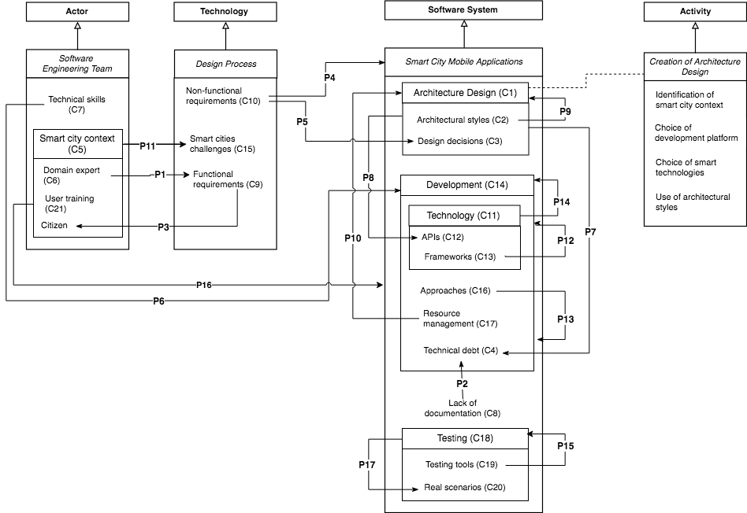

## Designing Smart City Mobile Applications: An Initial Grounded Theory

Authors: <a href="mailto:roselane.silva@ufba.br">Roselane Santana Silva</a>, Renata Souza Santos, John D. McGregor and Eduardo Santana de Almeida

This web page presents the supplementary material of the paper *Designing Smart City Mobile Applications: An Initial Grounded Theory*.

### Abstract
The software architecture community has played a crucial role in the development of mobile software. Many of the ideas used in the design of these systems came from traditional software architecture and those ideas have contributed to mobile computing becoming ubiquitous. Mobile applications in the context of smart cities are very challenging since they need to operate within the power, processor, and capacity limitations of mobile devices, the exacting demands of life critical smart city requirements, and the constantly changing and exposed environment which may not always be trusted. Since there are no widely accepted design models for this type of software, developers must resort to primitive design decisions to meet all the needs of these applications, which takes additional time and expertise. For this reason, the goal of this study is to investigate the design process for mobile applications in the context of smart cities. In order to address the lack of verified information about designing mobile apps, we conducted a multi-case study with 9 applications from 4 different development groups to build a grounded theory. The applications were reverse engineered to expose the architecture of each application. Given this data, interviews were conducted with developers who created the apps being studied. Based on all the data, an initial grounded theory was constructed to explain how the selected design process produces an app with the desired characteristics. The resulting theory offers explanations for how software engineering teams design mobile apps for smart cities. This knowledge will serve as a basis to further understand the phenomena and advances towards more effective design and development process definitions.

### Research Design 

Figure 1 describes the design of this study in terms of the activities and flow of information. The data collection activities are divided into two phases: case study and reverse-engineering. In the data analysis process we analyzed the evidence from the case study using Grounded Theory (GT) procedures to derive a theory.

**********

### DATA COLLECTION
#### Phase 1: Case Study
In phase 1 of this study, we conducted a multi case study using background questionnaires, archival records of the applications and 19 interviews with stakeholders of SE teams. We provide the following artifacts:

* The [background questionnaire](https://goo.gl/forms/G1kQeTNhXL1XdseI3)
* The [interview planning](https://github.com/rose2s/EMSE2019/blob/master/Case%20Study/Interview%20Planning.xlsx)
* The [interview protocol](https://github.com/rose2s/EMSE2019/blob/master/Case%20Study/Interview%20Protocol.txt)

**********

#### Phase 2: Reverse-Engineering Architecture

In phase 2 of this study, we reverse-engineered the software architecture of six apps that were either available in Google Play Store or we had acess to its APK file. This replication package contains:

* The full [tutorial](https://github.com/rose2s/EMSE2019/blob/master/Reverse-Engineering%20Architecture/Tutorial.txt) of the Reverse-Engineering Architecture;
* The [APKs](https://github.com/rose2s/EMSE2019/tree/master/Reverse-Engineering%20Architecture/apks) of the apps used for the study;
* The [acme](https://github.com/rose2s/EMSE2019/tree/master/Reverse-Engineering%20Architecture/acme) projects of the architecture used in ACME Studio tool;
* The [screenshots](https://github.com/rose2s/EMSE2019/tree/master/Reverse-Engineering%20Architecture/images) of the recovered architectures;
* The [feedback questionnaire](https://github.com/rose2s/EMSE2019/blob/master/Reverse-Engineering%20Architecture/Feedback%20Questionnaire.txt) used to validate the recovered architectures;

**********
### DATA ANALYSIS
For the data analysis process we analyzed the evidence from the case study using Grounded Theory (GT) procedures to derive a theory. 
We provide the following artifacts:

* The [coding project](https://github.com/rose2s/EMSE2019/blob/master/Coding.qdp) in QDAMiner tool
* The diagram from our [axial coding](https://goo.gl/k522DQ);

#### Theory 
The theory explains how SE teams design smart city mobile applications through the coding analysis of the case studies. It was presented according to [Sjøberg](https://link.springer.com/chapter/10.1007%2F978-1-84800-044-5_12) notation (Sjøberg, 2008), i.e., using constructs (C) and propositions (P).

The table below describes the final *propositions* produced by our study: 

|  | | 
 :------------: | :----------- |
**P1** | Domain experts positively impact the definition of requirements for a SCMA.
**P2** | The lack of documentation creates technical debt.
**P3** | Functional requirements for a SCMA come from a smart cities context, which is citizen-oriented.
**P4** | Some non-functional requirements are not taken into consideration by SE team when making design decisions.
**P5** | The satisfaction of non-functional requirements depends upon the design decisions made.
**P6** | The level of technical skills impacts the development of SCMA.
**P7** | Failing to implement architecture decisions creates technical debt.
**P8** | The architecture design of SCMA is mostly API-centric.
**P9** | The use of architectural styles positively impacts the design of SCMA.
**P10** | Effective mobile resource management positively impacts the architecture design of SCMA.
**P11** | The smart cities context brings more complexity to a mobile app's back-end.
**P12** |The development or adoption of smart city frameworks help to reduce the complexity of the development of SCMA.
**P13** | The adopted development approach and its associated tools bring specific development challenges for SCMA.
**P14** | Smart technologies positively impact the development speed of SCMA.
**P15** | The lack of automated testing tools for mobile applications negatively impacts the testing process of SCMA.
**P16** | Training internal users positively impacts the acceptance of SCMA products..
**P17** | Testing SCMA involves the need to simulate real-world scenarios.

**********

Figure 2 represents the *theory* in accordance with the constructs and propositions of how software engineering teams design mobile apps for smart cities. These relationships were based on information from several sources including discussions with the study participants, the professional and research literature, and the experience of the authors. 

**********

#### References

Dag I. K. Sjøberg, Tore Dybå, Bente C. D. Anda, and Jo E. Hannay, Building Theories in Software Engineering. Springer London, London, 312–336, 2008.

Taylor RN, Medvidovic N, Dashofy EM (2009) Software architecture: foundations, theory, and practice. Wiley, 1 edition

