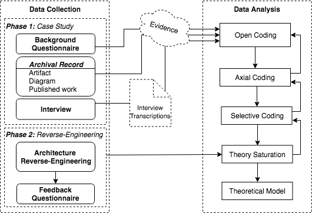

## Designing Smart City Mobile Applications: An Initial Grounded Theory

Authors: <a href="mailto:roselane.silva@ufba.br">Roselane Santana Silva</a>, Renata Souza Santos, John D. McGregor and Eduardo Santana de Almeida

This web page presents the supplementary material of the paper *Designing Smart City Mobile Applications: An Initial Grounded Theory*.

### Abstract
<div class=text-justify> The software architecture community has played a crucial role in the development of mobile software. Many of the ideas used in the design of these systems came from traditional software architecture and those ideas have contributed to mobile computing becoming ubiquitous. 
Mobile applications in the context of smart cities are very challenging since they need to operate within the power, processor, and capacity limitations of mobile devices, the exacting demands of life critical smart city requirements, and the constantly changing and exposed environment which may not always be trusted. Since there are no widely accepted design models for this type of software, developers must resort to primitive design decisions to meet all the needs of these applications, which takes additional time and expertise. For this reason, the goal of this study is to investigate the design process for mobile applications in the context of smart cities. In order to address the lack of verified information about designing mobile apps, we conducted a multi-case study with 9 applications from 4 different development groups to build a grounded theory. The applications were reverse engineered to expose the architecture of each application. Given this data, interviews were conducted with developers who created the apps being studied. Based on all the data, an initial grounded theory was constructed to explain how the selected design process produces an app with the desired characteristics. The resulting theory offers explanations for how software engineering teams design mobile apps for smart cities. This knowledge will serve as a basis to further understand the phenomena and advances towards more effective design and development process definitions. </div>

### Research Design


#### DATA COLLECTION
#### Phase 1: Case Study
| INTERVIEW | QUESTIONS |
| ------ | ------ |
| **Card 1** | **Requirements** |
|Q1 | What was your main role in the application?|
|Q2 | Could you talk about the software development team members of the project? |
|Q3 | How long did this project last?|
|Q4 | Where did the idea of the app come from? Did you think about the smart city context initially? |
|Q5 | How were the requirements defined? |
|Q6 | Was there any documentation? |
|Q7 | Did you analyze the main challenges of the project from a development perspective? If so, how did you mitigate them?
|Q8 | Could you cite any problem encountered and how did you resolve it?
|Q9 | (Show a list of non-funcional requirements and ask the following questions for each one:)  **a**. Why <performance> was [not] crucial; **b**. How did you deal with <performance> issues?; **c**. How was it specified? How was it modeled in the architecture? How was it implemented? What aspects of testing were applied to ensure <performance>? |
| **Card 2** | **Software Architecture** |
|Q10 | How was the system architecture designed? Was it based on something?|
|Q11 | Have you participated in any design decision in Architecture? Do you remember any?|
|Q12 | How were non-functional requirements (RNF) mapped in the architecture? How were they modeled? (Give examples of RNF)|
|Q13 | Has any architectural pattern been adopted? (show pattern's list)|
|Q14 | Has any architectural style been adopted? (show style's list)|
| **Card 3** | **Mobile Development** |
|Q14 |What were the main challenges faced in the development of the mobile application?|
|Q14 | What development approach (native, hybrid or web) was used to develop the application? Why?|
|Q14 | Have you used any framework during development? Which one?|
|Q14 | What smartphone features (GPS, camera, audio) does the application use and how?|
|Q14 | Have you thought about maximizing battery life and managing these resources? How?|
|Q14 | Has any test method for mobile applications been used? Which one?|

**********

### Reverse-Engineering Architecture

> **Steps**

    - Get the apk file
    - Use COVERT tool to generate the intermediate code (*file.xml*)
    - Add *file.xml* into *ACME-Generator* folder with *file.apk*
    - Execute the comand line to generate *file.acme*
    - Open *file.acme* in ACME STUDIO
    
##### APk & COVERT

```sh
$ java -jar apktool.jar d K-9\ Mail_5.207_apk-dl.com.apk -f
```

| Apk converter | Site |
| ------ | ------ |
|Apkbucket |  [apk-downloader](https://apkbucket.net/apk-downloader) |
|Apktool |  [apk-dl](http://apk-dl.com) |
|Project | [Project](http://www.ics.uci.edu/~seal/projects/covert/index.html) |
|Tutorial | [Tutorial](http://www.ics.uci.edu/~seal/projects/covert/COVERT%20User%20Manual_v2.0.pdf) |
|ACME-Generator | [ACME-Generator](https://github.com/arsadeghi/ACME-Generator) |

- Add o file *example.apk* em Covert folder
- Comando: ```sh $ ./covert.sh folder ```
- Output: *example.xml* (locaded in folder/analysis/model/example.xml)

##### ACME-Generator
- Add a saída do covert na pasta ACME-Generator-master
- Comando: ```sh run.py ./apps/example.apk ./resources    ```
- Output: *example.acme*

##### ACME STUDIO
- Create a new project
- Add file *example.acme* in ACME workspace
- Refresh project

**********

### Theory

#### Constructs of the theory
 
|  | |  |
| :------: | :------ | :------ |
| **C1** | *Architecture design* | A high-level structural design of a software system.
| **C2** | *Architectural styles* | A set of design decisions that identify the kinds of components and connectors that may be used to compose a system or subsystem. |
| **C3** | *Design Decisions* | A description of the set of architectural additions,  subtractions and modifications to the software architecture, the rationales, design rules, and design constraints and additional requirements that (partially) realize one or more requirements on a given architecture.
| **C4** | *Technical debt* | A concept in SE that reflects the extra development work that arises when code that is easy to implement in the short run is used instead of applying the best overall solution. 
| **C5** | *Smart city context* | Mobile apps about city innovation in management and policy as well as technology. 
| **C6**| *Domain experts* | A person with special knowledge in the context in the domain of smart cities (e.g., a firefighter is an expert in an emergency management app).
| **C7** | *Technical skills* | Abilities needed for software programming.
| **C8** | *Documentation* | Artifacts about the software (e.g., requirement specification).
| **C9** | *Functional requirements* | A requirement that defines what a system is supposed to do.
| **C10** | *Non-functional requirements* | A requirement that specifies criteria that can be used to judge the operation of a system, rather than specific behaviors.
| **C11** | *Technologies* | Technical tools that support the software development.
| **C12** | *API* | A software intermediary that allows apps to talk to each other.
| **C13** | *Framework* | It is a coherent unit of reuse, both by use-relationships and by extension through sub-classing.
| **C14** | *Software development* | The process of specifying, designing, developing, and testing involved in mobile applications. 
| **C15** | *Challenges* |Challenges faced when designing and developing a SCMA. 
| **C16** | *Development Approach* | There are three primary approaches to building mobile apps: web, hybrid and native.
| **C17** | *Resources management* |The effective use of mobile resources.
| **C18** | *Software Testing* |An investigation conducted to provide information about the \quality of the software product.
| **C19** | *Testing Tools* | Software intended to help software engineers to find bugs in mobile apps.
| **C20** | *Testing Issues* | Issues related to testing mobile software (e.g., testing real scenarios).
| **C21** | *User Training* | Process of training a staff who will work supporting the citizen through the app. 
#### Propositions of the theory


|  | | 
 :------------: | :----------- |
**P1** | Domain experts positively impact the definition of requirements for a SCMA.
**P2** | The lack of documentation creates technical debt.
**P3** | Functional requirements for a SCMA come from a smart cities context, which is citizen-oriented.
**P4** | Most non-functional requirements are not taken into consideration by the SE team when making design decisions.
**P5** | The satisfaction of non-functional requirements depends upon the design decisions made.
**P6** | The level of technical skills impact the development of SCMA.
**P7** | Lack of architecture decision-making  creates technical debt.
**P8** | The architecture design of SCMA is API-centric.
**P9** | The use of architectural styles positively impacts the design of SCMA.
**P10** | Effective mobile resource management positively impacts the architecture design of SCMA.
**P11** | The smart cities context brings complexity to mobile applications.
**P12** |The development or adoption of smart city frameworks reduces the complexity of the development of SCMA.
**P13** | The level of development challenges in SCMA depends upon the development approach adopted.
**P14** | Smart technologies positively impact the development speed of SCMA.
**P15** | The lack of testing tools for mobile applications negatively impacts the testing of SCMA.
**P16** | Training users positively impacts the product acceptance of SCMA.
**P17** | Testing SCMA involves the need to simulate real-world scenarios.

#### Representation of the theory
Figure 2 represents the theory in accordance with the constructs and propositions.

